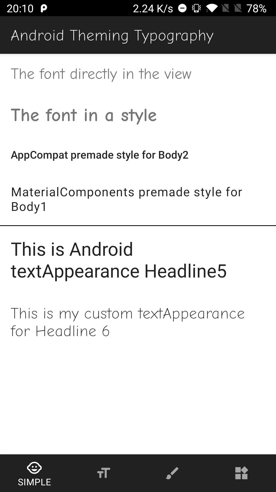
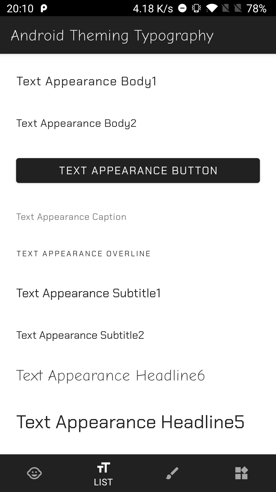
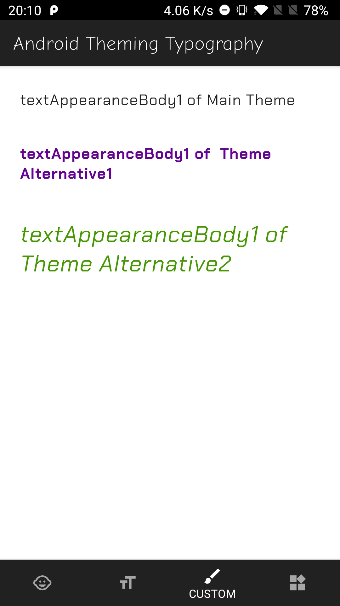
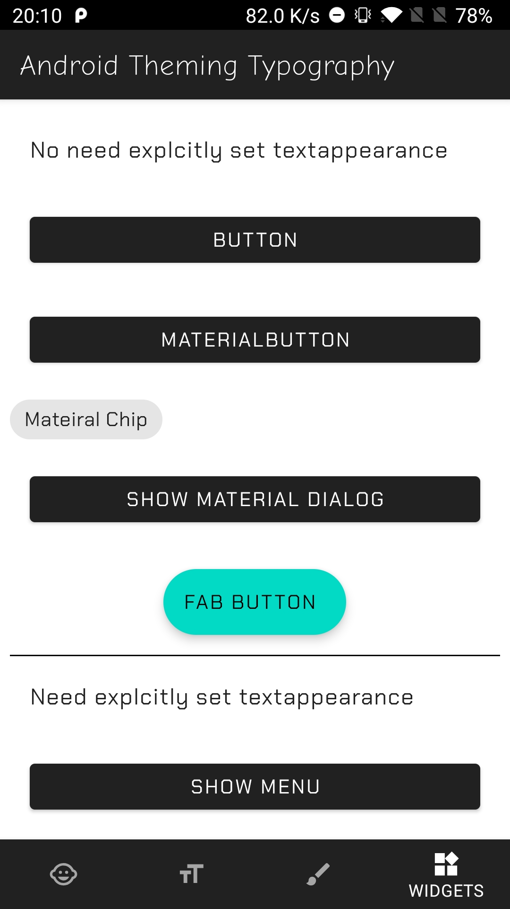
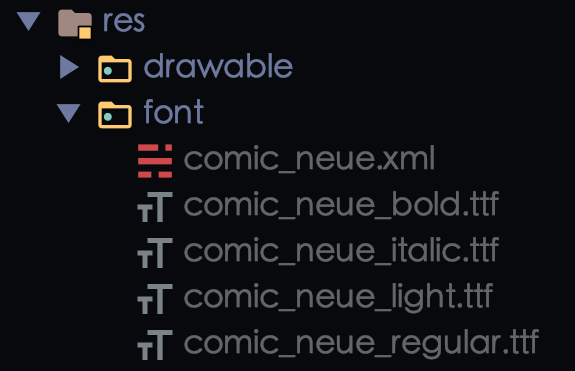
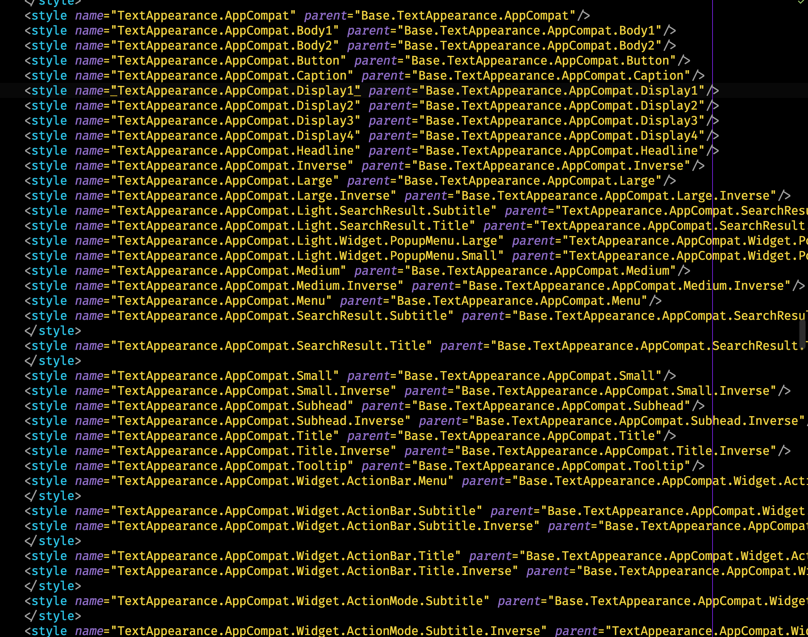
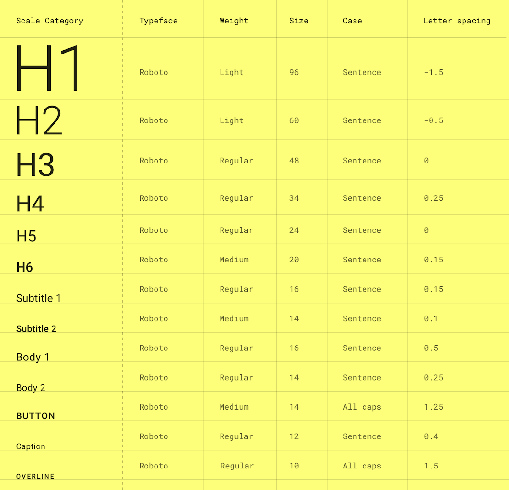
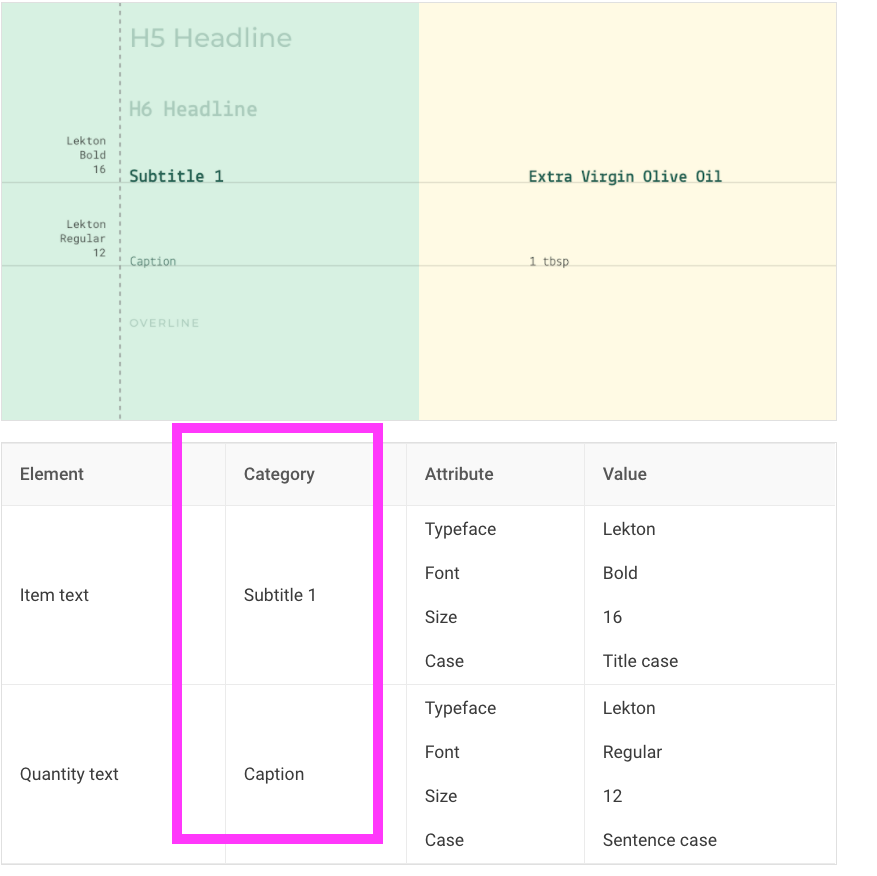
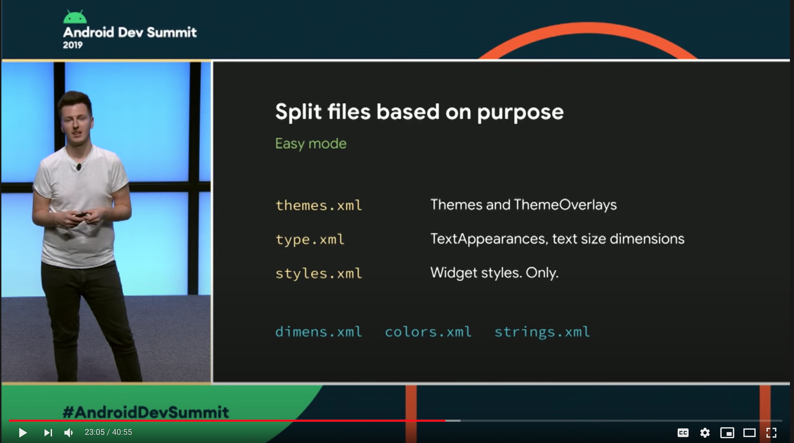
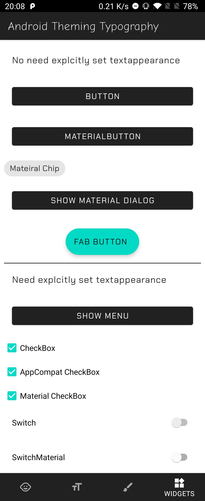

Companion App for the Article `Android App Theming: Typography` published in : [proandroiddev.com](https://proandroiddev.com/android-design-system-and-theming-typography-6260c37b1243) You also can read it in the readme
<div style= "display: flex; flex-flow: row wrap; justify-content: space-between;">
    
    
    
    
</div>


# Android Design System and Theming: Typography
<!-- TOC -->

- [Android Design System and Theming: Typography](#android-design-system-and-theming-typography)
- [1. Introduction](#1-introduction)
- [2. Using Fonts](#2-using-fonts)
  - [Add Fonts to your project](#add-fonts-to-your-project)
  - [Applying the fonts](#applying-the-fonts)
- [3. The Android Design System](#3-the-android-design-system)
  - [Built-in styles](#built-in-styles)
- [4. The Material Design Type System](#4-the-material-design-type-system)
- [5. Android Theming](#5-android-theming)
  - [Theme attributes vs View attributes (in less than 100 words)](#theme-attributes-vs-view-attributes-in-less-than-100-words)
  - [Android text appearance attributes](#android-text-appearance-attributes)
- [6. Creating Custom Themes](#6-creating-custom-themes)
- [7. Extra](#7-extra)
  - [Overlays](#overlays)
  - [Widgets](#widgets)
  - [Material Components vs AppCompat. Which library should I use?](#material-components-vs-appcompat-which-library-should-i-use)
- [8. Recap](#8-recap)
- [9. Conclusion](#9-conclusion)

<!-- /TOC -->

# 1. Introduction

Managing the look and feel of an Android app can get tedious, and more when the app gets bigger.
Style definitions, color attributes, sizes, etc. grow and grow if we don't manage them properly. 
Even if we can control them, a big set of style definitions can be difficult to follow.

To solve this problem it is recommended, first, to have a Style System (a concrete and small set of styles).
And secondly, apply it in your application. For this second part, **Android Theming** can help us.

Because this topic is large, in this article I will focus just on the typography.

* We will see first, how to apply different text fonts in our app. [2. Using Fonts](#2-using-fonts)
* Then we will review how Android uses differents text styles internally and how we can use them. [3. The Android Design System](#3-the-android-design-system)
* After that, we will review [4. The Material Design Type System](#4-the-material-design-type-system) and its relation with [5. Android Theming](#5-android-theming)
* And finally, we will see how to use and customize our typography. [6. Creating custom Theme Styles](#6-creating-custom-theme-styles)

> **Companion App**: You can follow this article with this Github Project: [Android Design System and Theming: Typography](https://github.com/HugoMatilla/Android-Design-System-and-Theming-Typography)

# 2. Using Fonts
## Add Fonts to your project

Since Android 8.0 fonts can be used as resources. For previous versions, you can use the Support Library 26.  

Firstly create the `font` folder under the `res` folder. Secondly, add your fonts there. Names must be lower case and with underscores. Like other xmls in Android.




Finally, create your font family resources xml file. Here is where the definitions of your fonts will be.

`comic_neue.xml`
```xml
<?xml version="1.0" encoding="utf-8"?>
<font-family xmlns:app="http://schemas.android.com/apk/res-auto">
 <!-- You can use `android:` instead of `app:` for API level >= 26   -->
  <font
    app:font="@font/comic_neue_regular" 
    app:fontStyle="normal"
    app:fontWeight="400" />

  <font
    app:font="@font/comic_neue_bold"
    app:fontStyle="normal"
    app:fontWeight="700" />

  <font
    app:font="@font/comic_neue_light"
    app:fontStyle="normal"
    app:fontWeight="200" />

  <font
    app:font="@font/comic_neue_italic"
    app:fontStyle="italic"
    app:fontWeight="400" />

</font-family>
```
> * `fontWeight` : Positive number, a multiple of 100, and between 100 and 900, inclusive. The most common values are 400 for regular weight and 700 for bold weight.
> * `fontStyle`: `normal` or `italic`     
> * [Official Documentation](https://developer.android.com/guide/topics/resources/font-resource#bundled-font)    

> **Using in Support Library**: Declare font families in XML, using the `app` namespace.
> [Official Documentation](https://developer.android.com/guide/topics/ui/look-and-feel/fonts-in-xml#using-support-lib)

We have everything set up. Now let's use it.

## Applying the fonts
There are 3 ways to do that.

> Check the companion project `app` module to see it working. [fragment_simple.xml](https://github.com/HugoMatilla/Android-Design-System-and-Theming-Typography/blob/master/app/src/main/res/layout/fragment_simple.xml)
 
#### 1. We can use the fonts directly in the view
```xml
  <TextView
    ... 
    android:fontFamily="@font/comic_neue"/>
```
#### 2. Or we can better create and use a style
```xml
  <style name="MyFontStyle">
    ...
    <item name="fontFamily">@font/comic_neue_bold</item>
  </style>
```
```xml
  <TextView
    ...
    style="@style/MyFontStyle"/>
```
#### 3. But what we really want is to use the Android built-in Design System
Let's see how it can be done.

# 3. The Android Design System

## Built-in styles
Android **AppCompat** library and the **Material Design** library offer us a set of premade styles that we can use and modify.
Like for example the `TextAppearance.AppCompat.Display1`

We can use it like any other `style`
```xml
<TextView
    style="@style/TextAppearance.AppCompat.Display1"
    .../>
```

In Android Studio right clicking on the style and following the path, we can reach the definition of the style. In this case `TextAppearance.AppCompat.Display1` inherits from `Base.TextAppearance.AppCompat.Display1` that results in this definition:
```xml
    <style name="Base.TextAppearance.AppCompat.Display1">
        <item name="android:textSize">@dimen/abc_text_size_display_1_material</item>
        <item name="android:textColor">?android:textColorSecondary</item>
    </style>
```
> in `v21` is actually `TextAppearance.Material.Headline` but the attributes are very similar.

The same happens with the Material Design Library. For `TextAppearance.MaterialComponents.Body1` we can see that it inherits from an appcompat style.

```xml
<style name="TextAppearance.MaterialComponents.Body1" parent="TextAppearance.AppCompat.Body2">
```

This is cool. We can get some premade styles to use in our Design System and tweak them instead of building them from scratch.

The first question would be: Is there a list of all these cool styles?

There are predefined styles for AppCompat and Material Design Libraries.
In the next image, you can see some `TextAppearance` styles from the AppCompat Library.


<p></p>
These look big and overwhelming but don't worry we are going to simplify all of it.

# 4. The Material Design Type System
To continue, let's check the Material Design documentation for [Type Scale](https://material.io/design/typography/the-type-system.html#type-scale) about typography.

The main 2 points of its definition are:
> * A range of contrasting styles that support the needs of your product and its content.
> * A combination of thirteen styles that are supported by the type system. It contains reusable categories of text, each with an intended application and meaning.

**TL;DR:** They defined 13 styles that should be enough for any application. 

Here are the 13 styles:


<p></p>

These styles are used in all the Material Design Definitions. If you go to the Material Design documentation, and look for a component you will find the corresponding **Type Scale Category** associated with each element.

For example, in the `List` component in the [theming typography section](https://material.io/components/lists#theming) you can see how they use the **Type Scale Category** to define the styles of the different list components. 


<p></p>

Now let's go back to Android

# 5. Android Theming
## Theme attributes vs View attributes (in less than 100 words)

The Android system defines **Theme Attributes**. Let's see how they differ from the **View Attributes**.

### View attributes: 
  * Applied to a single **View**.
  * `android:textColor=red`, `android:fontFamily="@font/comic_neue"`. 

```xml
<TextView
    ... 
    android:fontFamily="@font/comic_neue"/>
```
### Theme attributes. 
  * Applied to a **Theme**, not a view. 
  * `colorPrimary = red`,  `textAppearanceBody1 = ... `. 
  * They are defined in the **Theme**
  * The **Theme** provides and varies them.
  * They will be the same in all the application.
  * Should be used widely.

```xml
  <style name="Base.Theme.MyApp" parent="Theme.MaterialComponents.DayNight.DarkActionBar">
    <item name="textAppearanceBody1">@style/TextAppearance.MyApp.Body1</item>
  </style>
```
To use them just set them with the `?attr` keyword first.

```xml
  <TextView
  ...
  android:textAppearance="?attr/textAppearanceBody1" />
```

## Android text appearance attributes
We are talking about typography, so which are the **Theme Attributes** for typography. 
```xml
   textAppearanceBody1
   textAppearanceBody2
   textAppearanceButton
   textAppearanceCaption
   textAppearanceHeadline1
   textAppearanceHeadline2
   textAppearanceHeadline3
   textAppearanceHeadline4
   textAppearanceHeadline5
   textAppearanceHeadline6
   textAppearanceOverline
   textAppearanceSubtitle1
   textAppearanceSubtitle2
```

If you remember, the Material Design Docs said: "*13 type styles would be enough*". Android provides us with these 13 **theme attributes**.

All these **Theme Attributes** are set to a specific premade style, and as we did before with the premade styles, we can do it with the **theme attributes**.

```xml
  <TextView
  ...
  android:textAppearance="?attr/textAppearanceHeadline5" />
```

To know which are the default styles that Android uses we just need to follow the path of the theme. Right-click on the attribute, follow the thread until you find the style.
For `Theme.MaterialComponents.DayNight.DarkActionBar` you can reach how `textAppearanceBody1` is set to the style `TextAppearance.MaterialComponents.Body1`
```xml
<item name="textAppearanceBody1">@style/TextAppearance.MaterialComponents.Body1</item>
```


You can see that we end up in `Base.V14.Theme.MaterialComponents.Light.Bridge` 

> Remember:
> * `res/values/styles.xml`     : themes for all versions
> * `res/values-v21/styles.xml` : themes for API level 21+ only

The full list of Typestyles in the Material Design library is this one. 

```xml
    <!-- Type styles -->
    <item name="textAppearanceHeadline1">@style/TextAppearance.MaterialComponents.Headline1</item>
    <item name="textAppearanceHeadline2">@style/TextAppearance.MaterialComponents.Headline2</item>
    <item name="textAppearanceHeadline3">@style/TextAppearance.MaterialComponents.Headline3</item>
    <item name="textAppearanceHeadline4">@style/TextAppearance.MaterialComponents.Headline4</item>
    <item name="textAppearanceHeadline5">@style/TextAppearance.MaterialComponents.Headline5</item>
    <item name="textAppearanceHeadline6">@style/TextAppearance.MaterialComponents.Headline6</item>
    <item name="textAppearanceSubtitle1">@style/TextAppearance.MaterialComponents.Subtitle1</item>
    <item name="textAppearanceSubtitle2">@style/TextAppearance.MaterialComponents.Subtitle2</item>
    <item name="textAppearanceBody1">@style/TextAppearance.MaterialComponents.Body1</item>
    <item name="textAppearanceBody2">@style/TextAppearance.MaterialComponents.Body2</item>
    <item name="textAppearanceCaption">@style/TextAppearance.MaterialComponents.Caption</item>
    <item name="textAppearanceButton">@style/TextAppearance.MaterialComponents.Button</item>
    <item name="textAppearanceOverline">@style/TextAppearance.MaterialComponents.Overline</item>
```

Now we can use the Materail theme as a base for our custom Type Styles.

# 6. Creating Custom Themes

For example, to create our custom style for the `Headline5`, we can do as follows.

First, create a file under the `res` folder called `type.xml`. 

>Instead of creating the style in the `styles.xml` the new recommendation is the one presented in [Developing Themes with Style (Android Dev Summit '19)](https://youtu.be/Owkf8DhAOSo?t=1315)


Second, add your TextAppearance style.
`type.xml`
```xml
<style name="TextAppearance.MaterialComponents.Headline5.MyApp">
  <item name="fontFamily">@font/comic_neue_light</item>
  <!-- You can customize other attributes -->
  <item name="android:textColor">...</item>
  <item name="android:textSize">...</item>
</style>
```
> **Easy Hierarchy**: 
> Dot notation also applies inheritance so this `TextAppearance.MaterialComponents.Headline5.MyApp`  inherits from `TextAppearance.MaterialComponents.Headline5`. You don't need to specify the parent explicitly.

Inheriting from the `MaterialComponents` styles will reduce the number of attributes to set and will make your application more consistent with the Material Design Guidelines.

Finally, we need to set up this style to our **Theme Attribute** in our **Theme Definition**.

In your `themes.xml` add the definition.

```xml
<style name="Base.Theme.MyApp" parent="Theme.MaterialComponents.DayNight.DarkActionBar">
  <item name="textAppearanceHeadline5">@style/TextAppearance.MaterialComponents.Headline5.MyApp</item>
</style>
```

Don't forget to add your theme in the manifest.
```xml
<application
...
android:theme="@style/Base.Theme.MyApp">
```

And that's it.

In all the `TextViews` whose `textAppearance` is set to  `textAppearanceHeadline5`, your custom style will be set. 

```xml
  <TextView
  ...
  android:textAppearance="?attr/textAppearanceHeadline5" />
```

# 7. Extra

## Overlays
Another cool feature in the Android Theming System is theme overlays.
A **Theme Overlay** is a technic to change the theme of a part of your view and its descendant in a simple easy way.

In any of your views, you can add the `android:theme` attribute and set it to a specific theme. The view and all its children will use the new theme.

`types.xml`
```xml
  <style name="TextAppearance.MaterialComponents.Body1.MyApp.Alternative">
    <item name="fontFamily">@font/chakra_petch_bold</item>
    <item name="android:textColor">#660099</item>
  </style>
```
`styles.xml`
```xml
<style name="Theme.MyApp.TypeScale.Alternative" parent="Theme.MyApp.TypeScale">
    <item name="textAppearanceBody1">@style/TextAppearance.MaterialComponents.Body1.MyApp.Alternative</item>
  </style>
```
`fragment_custom.xml`
```xml
  <TextView
      android:layout_width="match_parent"
      android:layout_height="wrap_content"
      android:layout_margin="16dp"
      android:text="textAppearanceBody1 of Main Theme"
      android:textAppearance="?attr/textAppearanceBody1" /> <!-- Uses the app themes textAppearanceBody1-->

    <LinearLayout
      android:layout_width="match_parent"
      android:layout_height="wrap_content"
      android:theme="@style/Theme.MyApp.TypeScale.Alternative">

      <TextView
        android:layout_width="match_parent"
        android:layout_height="wrap_content"
        android:layout_margin="16dp"
        android:text="textAppearanceBody1 of Theme Alternative1"
        android:textAppearance="?attr/textAppearanceBody1" /> <!-- Uses the alternative themes textAppearanceBody1-->

    </LinearLayout>

```


> Check this in the companions app `typescale` module [fragment_custom.xml](https://github.com/HugoMatilla/Android-Design-System-and-Theming-Typography/blob/master/typescale/src/main/res/layout/fragment_custom.xml)

## Widgets
Some widgets will use the **Theme Attributes**, so if you have all set you won't need to change anything on the widget, the style will get it properly.

> Check this in the companions app `typescale` module [fragment_widgets.xml](https://github.com/HugoMatilla/Android-Design-System-and-Theming-Typography/blob/master/typescale/src/main/res/layout/fragment_widgets.xml)

As you can see in the Companion App in the Widgets Tab, the `Button` and the `MaterialChip` widgets do not set any `textAppearance` in its definition, and it shows the correct **Type Style**.
But others like the `CheckBox` or the `Switch` do not have a default `textAppearance`. For these (and others) widgets, you would need to set it explicitly. 



##  Material Components vs AppCompat. Which library should I use?
I would suggest to go with the Material Components Library, the style is more aligned with the Material Documentation. 

In case you can't add the library, go with Appcompat but be aware that some theme attributes do not have the corresponding premade style. 
Like there is no  `TextAppearance.AppCompat.Subtitle1` or `Headline,2,3,4` but instead `Display1,2,3`. 

# 8. Recap
There are 4 steps to have your custom type styles in your Android App using Theming:
1. Add your fonts.
2. Create a Theme: `<style name="Base.Theme.MyApp" parent="Theme.MaterialComponents.DayNight...`
3. Add to the theme, the custom styles for every **Text Appearance Theme Attribute**: `textAppearanceBody1`,`textAppearanceHeadline1`...
4. Apply them in your views: `android:textAppearance="?attr/textAppearanceBody1"`

# 9. Conclusion
Android Styling and Theming is a big topic but once you know how it works it can simplify your style definitions, and increase your development speed.

The Material Design library works pretty well with Android so you can benefit from it. And in case you need to add your custom Design System, it is very easy to create a theme and add your styles.

Many of the topics presented in this article can be applied not only to the typography, but also to colors and shapes. (Let me know if you liked this article and want me to write about colors and shapes).

Before saying goodbye I recommend you checking this Android Dev Summit talk [Developing Themes with Style](https://www.youtube.com/watch?v=Owkf8DhAOSo) by [Nick Butcher](https://twitter.com/crafty) and [Chris Banes](https://twitter.com/chrisbanes). There are also several [posts in Medium](https://medium.com/@crafty) by Nick Butcher covering all topics about theming and styling. 

Finally, I hope this article helps you to understand **Android Theming and Styling** a bit better.

Thank you for reading. 

PS: Thanks to @naufalaros for checking reviewing the article 😉